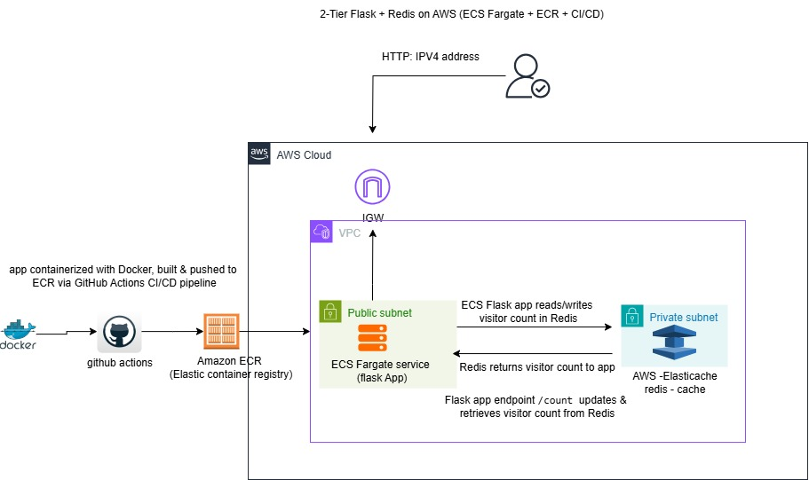
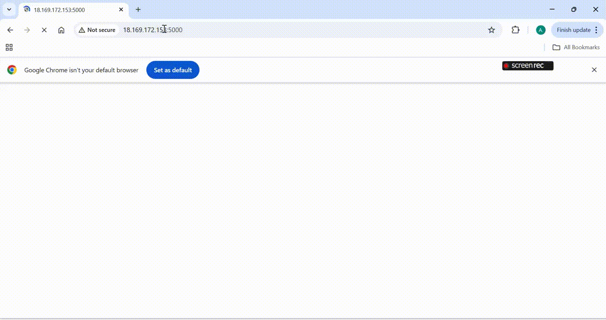

#  Project: Docker + Terraform + AWS  

This project demonstrates how to deploy a simple microservices application from local development to the cloud using modern DevOps tools and practices.  

The application is a lightweight **Flask web app (Python)** that uses **Redis** as an in-memory cache to track visitor counts. While the app itself is simple, the focus of this project is on showcasing **cloud deployment workflows, Infrastructure as Code (IaC), and CI/CD pipelines**.  

---

This project highlights my ability to:  
- 🐳 **Containerize applications** with Docker using efficient multi-stage builds.  
- ⚡ **Implement CI/CD pipelines** with GitHub Actions to automate builds and pushes to AWS ECR.  
- 🛠 **Provision infrastructure** with Terraform following Infrastructure-as-Code best practices.  
- ☁️ **Design microservices architecture** on AWS (Flask app + Redis cache).  

This serves as a practical learning project that combines **application development, DevOps practices, and cloud infrastructure** into one workflow.  

---

## 🔄 Workflow Overview  

1. **Application** → Flask + Redis app for visitor counting  
2. **Containerization** → Dockerized with multi-stage builds for optimized image size  
3. **Local Testing** → Docker Compose bridges Flask and Redis for local microservices testing  
4. **CI/CD Pipeline** → GitHub Actions builds and pushes images to AWS ECR  
5. **Infrastructure Provisioning** → Terraform provisions VPC, ECS Fargate, and Redis in a private subnet  
6. **Deployment** → Application runs in AWS using a two-tier architecture  

---

## 🛠 Tools & Technologies  

-  **Docker** → Multi-stage builds for efficient containerization  
-  **Docker Compose** → Local microservices testing (Flask + Redis)  
-  **GitHub Actions** → CI/CD pipeline for automation  
- ☁️ **AWS** →  
  - Elastic Container Registry (ECR)  
  - ECS Fargate for container orchestration  
  - VPC with public/private subnets  
  - Redis in private subnet  
-  **Terraform** → Infrastructure as Code for provisioning cloud resources

-  

---
## 📊 Architecture Diagram

  

## 🎥 Flask app

  

---

